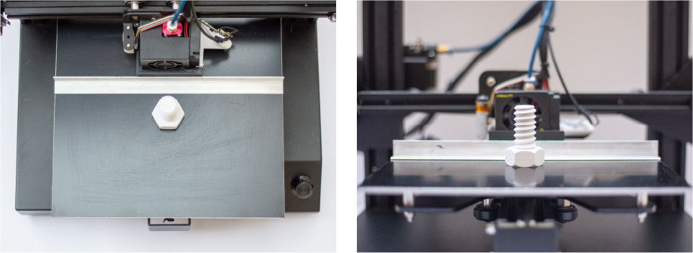

# Automated Part Remover for Creality 3D Printers

This repo contains the necessary files to upgrade your printer with an automated low-cost part removal system, as originally presented in the publication _"Generalisable 3D Printing Error Detection and Correction via Multi-Head Neural Networks"_.

The 2 main components of the system can be easily 3D printed - preferably out of a material which can withstand the temperatures of your build plate. Additionally 4 4mm disc magnets are required along with an aluminium "L" shaped extrusion profile measuring the width of the printer's build plate.

Assembly is easy with magnets press fitting into the designed recesses in the printed part and the extrusion profile can be attached using a standard high performance glue. For using the bed remover we recommend a build surface which releases the part at lower temperatures such as PEI or PrintBite+. An example g-code script is including for docking the printing head in the remover and dragging the removal system across the build surface to remove a part. This example is written for a Creality CR-20 Pro and may require modification.

Here is a GIF showing the automatic removal system removing a printed Cali Cat test part in PLA as an illustrative example.

